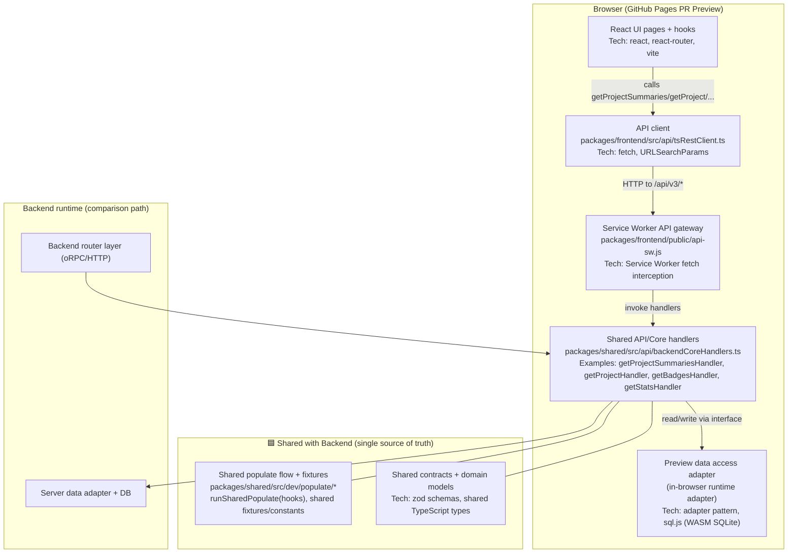

# Frontend Preview Architecture

This document describes how PR preview mode works in the browser, with explicit boundaries between:

- preview/runtime-specific code, and
- **shared backend logic** reused by both backend and preview.

## Mermaid diagram

## Key design notes

1. **Shared business logic first**
   - Request handling behavior should live in shared handlers (`packages/shared/...`) and be reused by both backend and preview.

2. **Runtime differences are isolated**
   - Backend uses server router + server DB adapter.
   - Preview uses Service Worker transport + browser-side adapter.

3. **API shape remains stable for UI**
   - The UI calls the same client methods (`getProjectSummaries`, `getProject`, etc.), minimizing page/component churn.

4. **Feature/package notes**
   - **Service Worker API**: request interception in browser preview.
   - **sql.js**: SQLite in browser via WASM.
   - **zod**: shared schema/contracts validation.
   - **TypeScript shared types**: same domain models across frontend/backend/shared.

## Current implementation status (high-level)

- Service Worker API interception is in place for preview requests.
- Base-path routing fixes were applied for GitHub Pages preview paths.
- Shared-handler usage is the intended architecture; remaining hardening focuses on extending route coverage and data lifecycle details.
